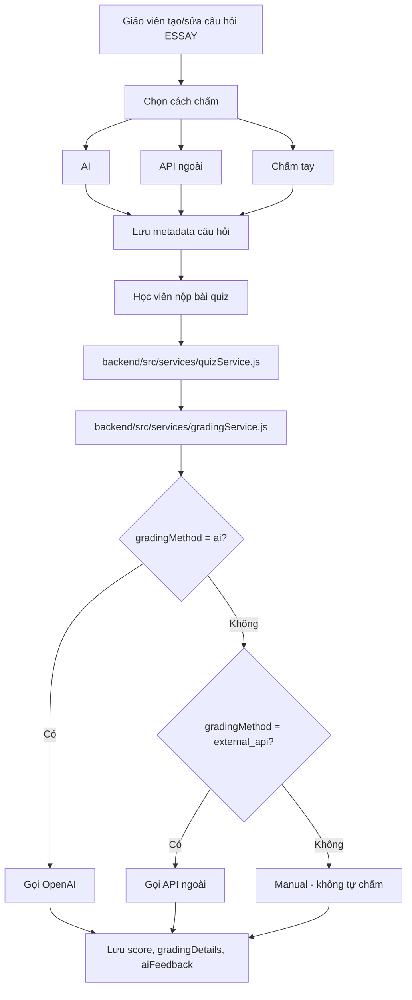

# Hướng Dẫn Chấm Tự Luận Bằng AI / API Ngoài

Tài liệu này mô tả luồng chấm câu hỏi **ESSAY** trong hệ thống hiện tại, bao gồm 3 chế độ:

- **AI**: hệ thống gọi OpenAI để chấm tự động.
- **API ngoài**: hệ thống gọi endpoint do giáo viên cung cấp.
- **Chấm tay**: hệ thống không tự chấm, giáo viên nhập điểm thủ công.

## 1. Luồng tổng quan

## 2. Dữ liệu giáo viên nhập khi tạo câu ESSAY

Trong form tạo/sửa câu hỏi, giáo viên sẽ thấy:

- **Hướng dẫn bài viết**: mô tả yêu cầu bài làm.
- **Số từ tối thiểu / tối đa**: dùng để kiểm tra độ dài bài.
- **Cách chấm**:
  - `AI`
  - `API ngoài`
  - `Chấm tay`
- **Mô hình AI**: chỉ hiện khi chọn `AI`.
- **URL API chấm điểm**: chỉ hiện khi chọn `API ngoài`.
- **Giá trị header xác thực**: chỉ hiện khi chọn `API ngoài`.
- **Rubric**: ít nhất 1 tiêu chí, tổng trọng số phải bằng 100.

Các trường này được lưu vào metadata của câu hỏi trong backend.

## 3. Luồng chấm bằng AI

Khi `gradingMethod = ai`:

1. Học viên nộp bài.
2. Backend lấy nội dung câu hỏi và metadata.
3. `gradingService.js` ghép:
   - nội dung câu hỏi
   - hướng dẫn bài viết
   - rubric
   - word limit
   - model AI
4. Backend gửi prompt lên OpenAI.
5. AI trả về JSON gồm:
   - `criteria`
   - `totalScore`
   - `overallFeedback`
6. Backend parse JSON, lưu điểm và phản hồi vào `StudentAnswer`.

## 4. Luồng chấm bằng API ngoài

Khi `gradingMethod = external_api`:

1. Học viên nộp bài.
2. Backend gọi endpoint trong `externalApiUrl`.
3. Body gửi đi thường gồm:
   - `answerText`
   - `questionContent`
   - `instructions`
   - `rubric`
   - `wordLimit`
   - `wordCount`
   - `withinWordLimit`
4. Nếu có `externalApiAuthHeader`, backend sẽ gắn header xác thực tương ứng.
5. API ngoài trả về kết quả chấm.
6. Backend chuẩn hóa kết quả đó thành:
   - `score`
   - `gradingDetails`
   - `aiFeedback`
7. Kết quả được lưu giống như AI để giao diện xem điểm không bị lệch.

## 5. Luồng chấm tay

Khi `gradingMethod = manual`:

- Hệ thống không tự gọi AI.
- Hệ thống không gọi API ngoài.
- Bài vẫn được lưu để giáo viên chấm thủ công.
- Điểm của bài ESSAY sẽ không bị tự động ép về 0 chỉ vì chưa chấm.

## 6. Các file liên quan

- [backend/src/services/gradingService.js](../src/services/gradingService.js)
- [backend/src/services/questionService.js](../src/services/questionService.js)
- [backend/src/services/quizService.js](../src/services/quizService.js)
- [backend/src/validations/questionValidation.js](../src/validations/questionValidation.js)
- [frontend/src/components/QuestionTypeFields.jsx](../../frontend/src/components/QuestionTypeFields.jsx)
- [frontend/src/components/QuestionFormModal.jsx](../../frontend/src/components/QuestionFormModal.jsx)

## 7. Ghi nhớ quan trọng

- Nếu chọn `API ngoài`, hãy nhập đúng URL hợp lệ.
- `externalApiAuthHeader` có thể chứa thông tin nhạy cảm, nên chỉ dùng khi thật sự cần.
- Rubric phải rõ ràng thì kết quả chấm AI càng ổn định.
- `AI` và `API ngoài` đều đang được chuẩn hóa về cùng cấu trúc kết quả để giao diện hiển thị thống nhất.

## 8. Tóm tắt ngắn

Nếu muốn hiểu nhanh, chỉ cần nhớ:

- **AI**: hệ thống tự chấm bằng OpenAI.
- **API ngoài**: hệ thống gửi bài sang server bạn cấu hình.
- **Manual**: giáo viên chấm tay.

